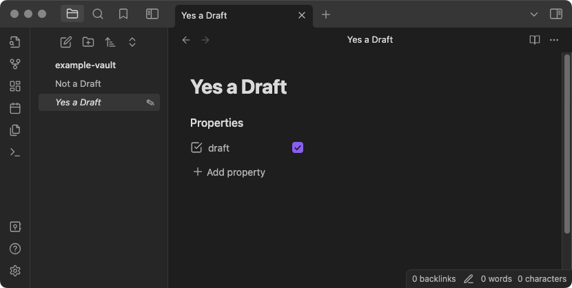

# Draft Indicator

Draft Indicator updates the file explorer to show a wee ✎ pencil icon next to any note with `draft: true` in its frontmatter. It also italicizes the note name.

## Features

- `✎`
- `font-style: italic;`

## Settings

No.
